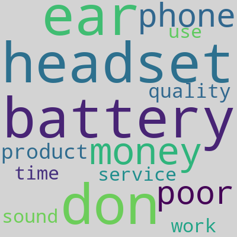

# Sentiment Analysis using Scikit-Learn
## Introduction
This project details how machine learning can be used to classify Amazon reviews as having positive or negative sentiment. In addition, it explores the pre-processing steps involved with text classification.

My goal was to learn more about natural language processing and preparing text data for machine learning. Also, I wanted to see how preprocessing affects a machine learning model's accuracy.
## Selection of Data
The data has 1000 samples of excerpts from Amazon reviews with sentiment labels (positive or negative). Half of the samples are positive and half are negative. The dataset can be found on the UCI Machine Learning Repository [1].

The objective is to label each text as having positive or negative sentiment.
### Preview of Data
```
So there is no way for me to plug it in here in the US unless I go by a converter.	0
Good case, Excellent value.	1
Great for the jawbone.	1
Tied to charger for conversations lasting more than 45 minutes.MAJOR PROBLEMS!!	0
The mic is great.	1
I have to jiggle the plug to get it to line up right to get decent volume.	0
If you have several dozen or several hundred contacts, then imagine the fun of sending each of them one by one.	0
If you are Razr owner...you must have this!	1
Needless to say, I wasted my money.	0
What a waste of money and time!.	0
```
Half of the samples are positive (labeled with 1) and half are negative (labeled with 0)
### Characteristics of the Data
As it is, the text has:
- Misspellings ("I purcashed this", "I definitly recommend", "I bougth it")
- Punctuation (periods, commas, exclamations, hyphens)
- Contractions (I've, don't, can't)

As a result, the text needs to be pre-processed before fitting a model. The pre-processing steps I took include:
- Converting the text to lower case
- Removing punctuation
- Tokenizing the text and for each word:
    * Correct spelling if necessary
    * Convert contractions to a common form ("don't", "dont" become "do not")
    * Lemmatize each word

Lemmatization converts words into a common form. For example, "purchase", "purchasing", "purchased" all become "purchase".
```
def preprocess_text(text):
    text = text.lower()
    tokens = tokenizer.tokenize(text)
    for i in range(len(tokens)):
        if tokens[i] in contractions.keys():
            tokens[i] = contractions[tokens[i]]
        else:
            tokens[i] = get_correction(tokens[i])
        tokens[i] = lemmatizer.lemmatize(tokens[i], pos='v')
    return " ".join(tokens)
```
## Methods
The tools I used include:
- nltk for tokenization and lemmatization
- symspellpy for spelling correction
- Pandas and scikit-learn for machine learning

I used the linear support vector classifier (linearSVC) model from scikit-learn

### TF-IDF
Before fitting the model, the text is transformed into a TF-IDF matrix. TF-IDF, or term frequency-inverse document frequency, is a way to measure the importance of a word in a set of documents, or a corpus.

To simplify my code, I created a pipeline. The pandas dataframe is converted into a TF-IDF matrix and fitted to the LinearSVC model.

## Results
After preprocessing the text, the model's accuracy increases from around 83% to 85%. Below are the top words from the positive and negative reviews:
### Positive reviews:


### Negative reviews:


# Discussion

After testing different models (MultinomialNB, DecisionTreeClassifier, LinearSVC), I found LinearSVC to be the most accurate. With all the models, accuracy increased slightly after pre-processing.

I encountered a few issues when attempting to preprocess the data. First, I attempted to split sentences by spacing and punctuation. However, contractions like “I’ve” would be split into two separate tokens, “I” and “‘ve”. Instead, I used nltk’s RegExpTokenizer to split words according to word characters and apostrophes. Then, contractions would remain a single token and I could convert them to a single common form.

# Summary
This project explored the different pre-processing steps that can be done before fitting a machine learning model to text data. Lowercasing text, correcting spelling, converting contractions to a common form,
and lemmatizing words all helped to increase the accuracy of the model. After these steps, the LinearSVC model's accuracy increased from around 83% to 85%

In addition, TF-IDF can be used to determine the most "important" words in a document, and is useful in text classification tasks.

## References
[1] 'From Group to Individual Labels using Deep Features', Kotzias et. al,. KDD 2015 - [Dataset link](https://archive.ics.uci.edu/ml/datasets/Sentiment+Labelled+Sentences)

[Preprocessing text in Python](https://towardsdatascience.com/preprocessing-text-in-python-923828c4114f) - Used to help understand tokenizing and lemmatizing using NLTK

[Python Data Science Handbook - Feature Engineering
](https://jakevdp.github.io/PythonDataScienceHandbook/05.04-feature-engineering.html) - Used to help learn how to use scikit-learn for text classification

[Text Normalization](https://towardsdatascience.com/text-normalization-7ecc8e084e31) - Used to help understand text normalization and for the [english_contractions.json file](https://gist.githubusercontent.com/Sirsirious/c70400176a4532899a483e06d72cf99e/raw/e46fa7620c4f378f5bf39608b45cddad7ff447a4/english_contractions.json)

